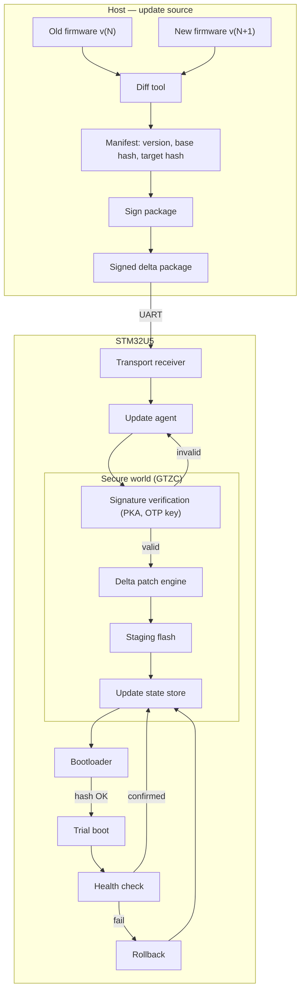

# Architecture

## Problem

Reference OTA implementations for microcontrollers typically assume a
duplicated firmware slot (A/B) and sufficient bandwidth to transfer a full
image on every update. Neither assumption holds for cost-constrained,
single-bank MCUs on low-bandwidth or metered links.

This project updates firmware via signed binary deltas, verified through a
hardware-rooted chain of trust, and applied through a power-loss-safe
staging process with automatic rollback.

## Design goals

- Hardware-rooted trust — signature verification anchored in boot ROM,
  read-out protection (RDP), and an OTP-provisioned public key
- Power-loss resilience — update state remains well-defined after a power
  loss at any point in the process
- Bandwidth and flash efficiency — delta patches rather than full-image
  duplication
- Fail-safe recovery — automatic rollback if a new image fails a post-boot
  health check

## Scope (v1)

Single-device updates over a wired UART link, from a host machine acting as
the update source. Fleet management, key rotation, and wireless transport
are treated as future work.

## Target hardware

STM32U5 (Cortex-M33, TrustZone), developed against a Nucleo-U575ZI-Q class
board. TrustZone secure/non-secure isolation is implemented via GTZC
(Global TrustZone Controller). The update-state store uses software EEPROM
emulation, as the U5 series does not implement a hardware high-cycle data
area.

## System architecture

## Design decisions

| Decision | Choice | Rationale |
|---|---|---|
| Board | STM32U5 | Low-power target; TrustZone via GTZC |
| State store | Software EEPROM emulation | No hardware EDATA on U5 |
| Transport (v1) | UART | Minimal viable proof of the full pipeline |
| Signature verification | Hardware PKA, ECDSA P-256 | Side-channel resistant, no external crypto library |
| Key management (v1) | Static public key in OTP | Sufficient for current scope |

## Roadmap

1. Secure boot and signed image verification
2. Power-loss-safe, redundant update-state store
3. Delta patch engine
4. Trial boot, health check, and rollback controller
5. Host-side tooling (patch generation, signing, manifest)
6. Wireless transport (future work)

## Future work

- Fleet-scale update orchestration
- Key rotation and revocation
- Wireless transport (BLE, LoRa, or cellular bridge)
